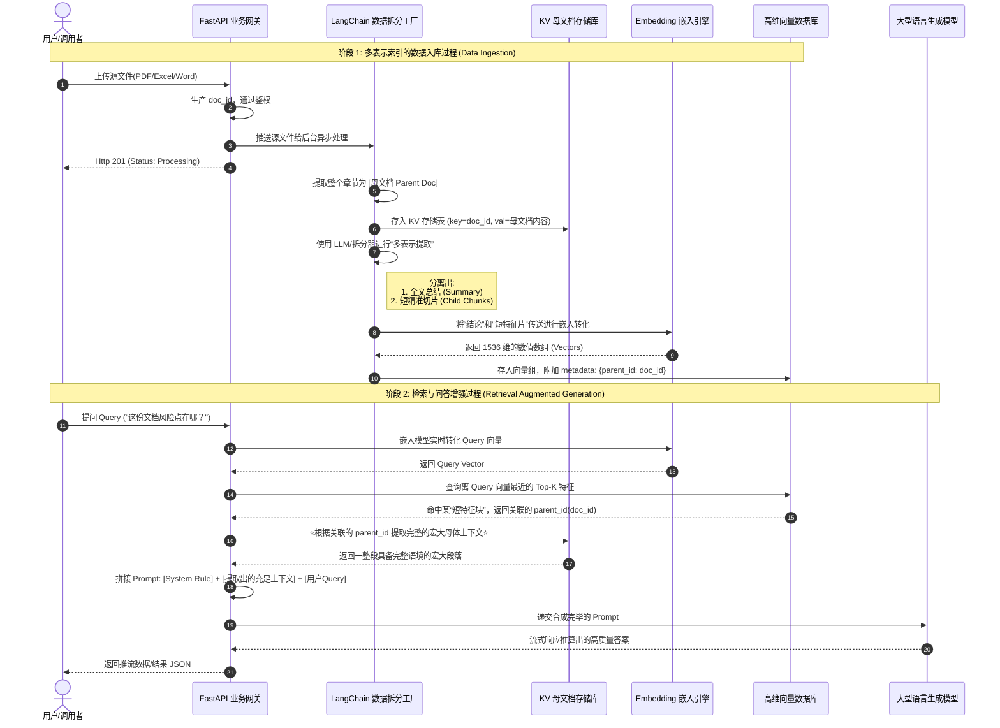

# 文档处理 Bot 系统架构图册 (Architecture Diagrams)

本文档为您提供了全面且精细的系统架构与数据流图表。您可以使用支持 Mermaid 渲染的 Markdown 编辑器（如 GitHub, VS Code, Obsidian 等）直接为您呈现可视图形。

---

## 1. 系统总体逻辑架构图 (System Architecture Topology)

本图展示了系统总体的分层架构：从终端用户的请求发起到核心 API 拦截、分发，直至最底层的异步处理、存储引擎与 LLM 无缝衔接。

```mermaid
flowchart TD
    %% 用户终端与网关
    ClientA[Web 前端门户] --> |"携带 JWT Access Token"| APIGateway
    ClientB[第三方企业系统] --> |"携带 API-Key"| APIGateway
    
    subgraph FastAPI 核心网关与调度层
        APIGateway(API 入口 / Load Balancer) --> SecDetector{安全鉴权依赖\n(Dependencies)}
        
        SecDetector -- 失败 --> 401[返回 HTTP 401]
        SecDetector -- 成功 --> Router[业务路由聚合]
        
        %% 核心路由模块
        Router -- "/auth" --> AuthRC(凭证颁发服务)
        Router -- "/documents" --> DocRC(上传处理服务)
        Router -- "/chat" --> ChatRC(问答对答服务)
    end
    
    subgraph 关系型持久化存储 (Meta Store)
        AuthRC <--> SQLDB[(MySQL / PostgreSQL)]
        SQLDB -.- |"存储：用户信息、\nToken记录、API-Key配置"| SQLDB
    end

    subgraph 后端异步流与 AI 生态 (AI & Data Pipeline)
        %% 分发机制
        DocRC -- "触发后台任务\n(BackgroundTasks)" --> IngestionWorker
        ChatRC -- "发起询问问答" --> RAGWorker
        
        %% 具体工作处理层
        IngestionWorker[文档解析与注入流水线]
        RAGWorker[检索及基于提示词的生成通道]
        
        %% AI 模型支撑层
        EmbeddingModel((Embedding 模型 \n 智谱/OpenAI))
        LLMModel((大规模语言模型 \n ChatGLM/千问/GPT-4))
        
        %% 数据落盘存储群
        VectorDB[(向量数据库\nMilvus/Chroma)]
        KVStore[(文档KV存储\nRedis/MongoDB)]
        
        %% 具体连接交互
        IngestionWorker <--> |"获取稠密向量"| EmbeddingModel
        RAGWorker <--> |"获取 Query 向量"| EmbeddingModel
        
        IngestionWorker --> |"1. 插入分块片段向量"| VectorDB
        IngestionWorker --> |"2. 存入母文档原文"| KVStore
        
        RAGWorker --> |"召回对比"| VectorDB
        RAGWorker --> |"溯源检索映射"| KVStore
        
        RAGWorker <--> |"传递完整语义组装生成"| LLMModel
    end

    %% 图表样式增强
    classDef client fill:#f9f9f9,stroke:#333,stroke-width:2px;
    classDef sys fill:#e1f5fe,stroke:#03a9f4,stroke-width:2px;
    classDef db fill:#fff3e0,stroke:#ff9800,stroke-width:2px;
    classDef ai fill:#f3e5f5,stroke:#9c27b0,stroke-width:2px;
    
    class ClientA,ClientB client;
    class FastAPI sys;
    class SQLDB,VectorDB,KVStore db;
    class EmbeddingModel,LLMModel ai;
```

---

## 2. 深入 RAG 与多表示索引数据流图 (RAG Data Flow)

此图重点剖析在上述文字说明中提到的 **“嵌入(Embedding)”** 与 **“多表示索引(Multi-representation Indexing)”** 具体是如何处理文件的。


